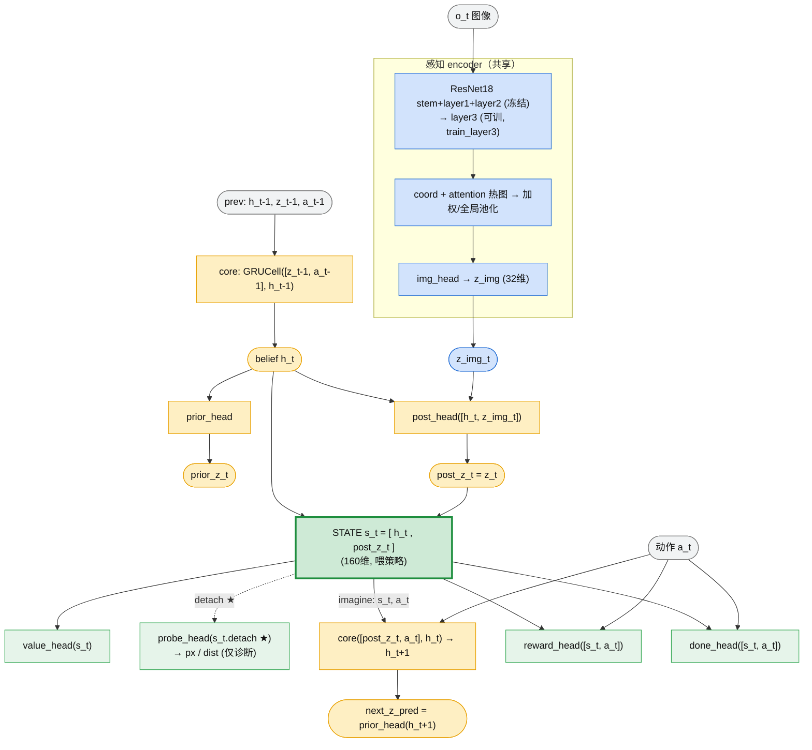
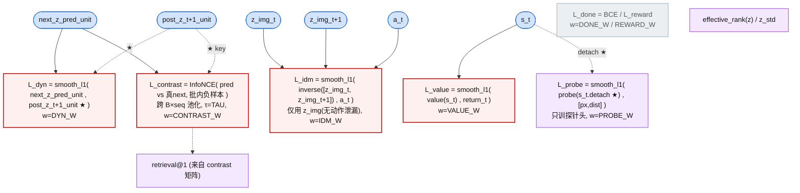

# MDP 视觉表征 当前流程图

> 反映 `src/mdp_state.py` + `train/mdp_state.py` 当前结构（自监督转移表征版）。
> ★ = stop-gradient（detach）。所有共享模块（encoder / core / prior_head）在 observe 和 imagine 里复用，不是多份。

## 图 1：模型前向（observe 真实步 + imagine 预测步）

## 图 2：训练损失与梯度（按时序 BPTT，★=目标 detach）

## 当前权重（建议起点，Preset A：纯自监督）

| 损失 | 权重 | 作用 | 塑造表征? |
|---|---|---|---|
| L_contrast | CONTRAST_W=1.0 (τ=0.1) | 防坍缩 + 状态可区分（主引擎） | 是 |
| L_idm | IDM_W=1.0 | 可控因子（bearing/距离变化），忽略噪声 | 是 |
| L_dyn | DYN_W=1.0（可设0，被 contrast 包含） | 转移一致（正样本拉近） | 是(小) |
| L_value | VALUE_W=0.0 | return 信息 | 关 |
| L_done / L_reward | 0.0 | 终止/奖励 | 关 |
| L_probe | PROBE_W=0.1 | px/dist **诊断**（detach，只训头） | 否 |

## 关键点
1. **IDM 用 z_img**（纯感知、无动作）：避免从 belief 直接读出 a_t 的平凡解。
2. **dyn / contrast 目标 detach**：防止 encoder 把自己训成“可预测的常数”而坍缩。
3. **probe 输入 detach**：只训探针头、不 ground 表征 → 是合法的“线性探针”诊断，不污染自监督。
4. **防坍缩靠 contrast（不是方差铰链）**：方差铰链只防常数坍缩、且与 dyn 互拽震荡；contrast 同时防常数/维度坍缩且稳定。
5. **判读顺序**：retrieval@1 / eff_rank 先确认没坍缩 → idm loss 是否下降 → 最后看(事后冻结的)probe_d 能否到 0.2m。
