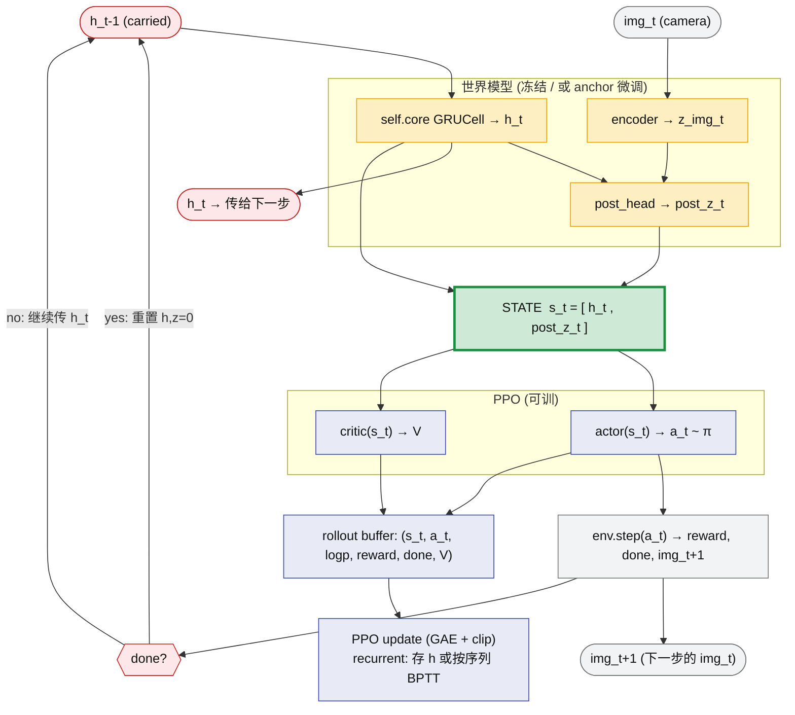

# MDPStateNet (RSSM-lite world model) 流程框图

> 注意:`encoder`、`self.core (GRUCell)`、`prior_head` 都是**单个共享模块**,在 observe(真实步)和 imagine(预测步)里**复用**。下图用 `(obs)`/`(img)` 边标区分两种用法,不是两个模块。

```mermaid
flowchart TB
  classDef perc fill:#d2e3fc,stroke:#1967d2,color:#111;
  classDef core fill:#feefc3,stroke:#e8a000,color:#111;
  classDef state fill:#ceead6,stroke:#1e8e3e,stroke-width:3px,color:#111;
  classDef head fill:#e6f4ea,stroke:#34a853,color:#111;
  classDef loss fill:#fff0f0,stroke:#c5221f,stroke-width:3px,color:#111;
  classDef io fill:#f1f3f4,stroke:#777,color:#111;

  img(["img_t"]):::io
  nimg(["img_t+1 (target)"]):::io

  subgraph ENC["PERCEPTION — encoder (shared)"]
    cnn["ResNet18 (stem+layer1-3) &rarr; attn/heatmap &rarr; pool &rarr; img_head"]:::perc
  end

  zimg(["z_img_t"]):::perc

  prev(["prev: h_t-1, z_t-1, a_t-1"]):::io

  core["self.core&nbsp;&nbsp;(单个共享 GRUCell)"]:::core
  prior["prior_head&nbsp;(共享)"]:::core
  post["post_head( [h, z_img_t] )"]:::core

  belief(["belief h_t"]):::core
  priorz(["prior_z_t"]):::core
  postz(["post_z_t"]):::core

  state["STATE&nbsp;&nbsp;s_t = [ h_t , post_z_t ]&nbsp;&nbsp;(RL state for PPO)"]:::state

  value["value_head&nbsp;(共享)"]:::head
  reward["reward_head"]:::head
  done["done_head"]:::head

  nbel(["h_t+1"]):::core
  nzpred(["next_z_pred"]):::core

  loss["LOSS = dyn&middot;||next_z_pred &minus; sg(z_img_t+1)||&nbsp;(&#9733; detach)<br/>+ reward + done + value(returns)<br/>+ prior(prior&rarr;posterior, sg post) + var(z)"]:::loss

  %% encoder (shared) on both frames
  img --> cnn --> zimg
  nimg --> cnn

  %% observe: 真实步 (用 prev + 当前图像的后验修正)
  prev -- "(obs)" --> core
  core -- "(obs)" --> belief
  belief -- "(obs)" --> prior -- "(obs)" --> priorz
  belief --> post
  zimg --> post --> postz
  belief --> state
  postz --> state

  %% heads
  state --> value
  state --> reward
  state --> done

  %% imagine: 预测步 (复用同一 core / prior, 无图像走先验)
  state -- "(img) s_t, a_t" --> core
  core -- "(img)" --> nbel
  nbel -- "(img)" --> prior
  prior -- "(img)" --> nzpred

  %% losses
  nzpred --> loss
  nimg -. "encode &rarr; z_img_t+1 .detach() &#9733;" .-> loss
  priorz -. "prior" .-> loss
  reward -.-> loss
  done -.-> loss
  value -.-> loss
```

## 共享模块(关键:不是重复结构)
- **encoder**:对 `img_t`(observe)和 `img_t+1`(dyn 目标)都用同一个。
- **`self.core` GRUCell**:observe 里 `core([z_t-1,a_t-1], h_t-1)→h_t`;imagine 里 `core([post_z_t,a_t], h_t)→h_t+1`。**同一个权重,推进一步而已。**
- **prior_head**:observe 出 `prior_z_t`,imagine 出 `next_z_pred`,**同一个头**。
- **post_head** 只在 observe 用(需要图像)。**value_head** 在 observe 出 V(s_t)、imagine 出 V(s_t+1),共享。

## 三个关键点 (★)
1. **dyn 目标 detach**:`next_z = encode(img_t+1).z_img.detach()`,否则编码器被训成"让自己可预测" → 坍缩。
2. **序列 + BPTT**:GRU 的 belief 靠时序累积,按整段轨迹训、done 处重置;打乱单步 transition 会让循环态恒为零起点、形同虚设。
3. **grounding**:稀疏奖励下 reward/value 锚得弱,`var(z)` 只防"常数坍缩"。优先 **probe(诊断,不回传)** 看 z 是否自学到球信息;真要 grounding 用**重建(自监督)**,px/dist 留作退火后备。

---

# 怎么接进 RL(PPO)

> 两阶段:① 离线在 data_mdp 上训世界模型(上图);② RL 时**冻结 encoder+core**(或带 anchor 微调),把 `state_feature=[h, post_z]` 当 PPO 的输入。**关键是 belief h 要在 rollout 里逐步传递、done 处重置(recurrent PPO)。**

## PPO 接入的坑(落地最容易卡这里)
- **belief 必须逐步传递**:`h_t` 由上一步算出,喂这一步的 `core`;**done 处把 h、z 重置为 0**(新 episode 不能带旧记忆)。
- **recurrent PPO**:PPO 更新要么**存下每步的 h**(简单),要么**按序列重放 + BPTT**(更准)。普通逐 transition 打乱的 PPO 不能直接用——会丢循环态。
- **encoder/core 冻结 vs 微调**:先冻结跑通(state 当固定特征);要"让表征继续适配策略"再带 **anchor** 解冻(见前面端到端微调那套)。
- **value/reward/done 头**是世界模型自带的;**PPO 用自己的 critic**,别和世界模型的 value 头混用(那是采集策略的 value、stale)。
